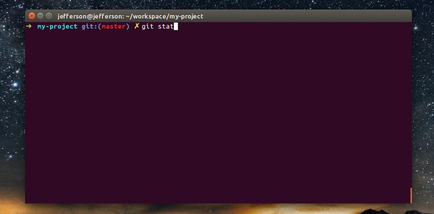

# Semantic Commit cli



## Install

Clone the repository
```bash
$ git clone git@github.com:jeffersondanielss/semantic-commit.git
```

Enter the repository folder
```bash
$ cd semantic-commit
```

Install Globally
```bash
$ npm i -g
```

#### Disclaimer
> [Semantic Commit Messages](https://seesparkbox.com/foundry/semantic_commit_messages).